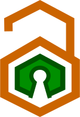

# Decentralized Open Science

The Decentralized Open Science Subgroup, consisting of Marco Beck, Cornelius Ihle, and Dennis Trautwein, with the goal to employ decentralized information technology to foster the open science movement.
Open Science, as, e.g., described in the [twelfe Vienna principles](https://viennaprinciples.org/) aim to make scientific processes more transparent and results more accessible.
However, there are many incentives to abstain from doing Open Science, e.g., confidentiality to keep a competitive advantage.
We believe that surpassing inherently scientific incentives are critical for a self-sustaining open science ecosystem.

Free and Open Source Software can look back on an impressive success story.
A success that introduced new incentives like faster development, faster innovation, and improved reliability.
We expect similar positive effects on Open Science.
Building tools (Open Source Software) for interdisciplinary Open Science is a logical resulting consequence.

Decentralization is the final iteration towards transparency and openness that we strive for.
We want to eliminate data silos and the dependency of Open Science tools on nontransparent central service providers.

---

## Content Protection
One pillar for risk-less Open Science is data protection. 
Our tools provide functionalities to obfuscate or anonymize sensitive data.

## Intellectual Property Protection
A second pillar is the attribution of intellectual property.
Tools that prove and track ideation, research, and development with the help of decentralized time-stamping safeguard our Open Science projects.

### Similarity Detection
Similarity detection provides a powerful tool to detect wrongful attribution of intellectual property.

## Reliable Data Stores
Decentralized data stores offer the possibility to keep scientific data available and accessible.

## Shared Computational Infrastructure
We deploy Distributed Ledger Technology to reward and journalize computational incentive evaluation tasks and Open Science tools, helping institutions and researchers to combine their computational resources.

